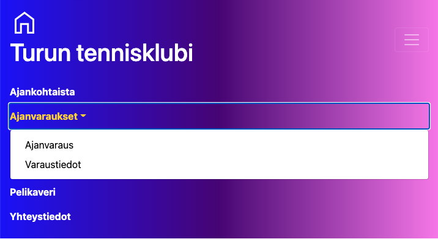
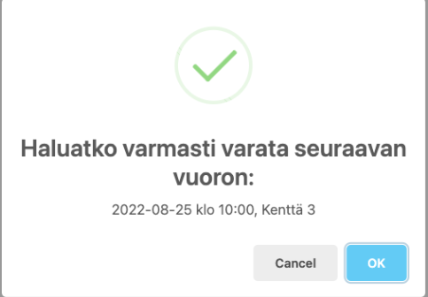
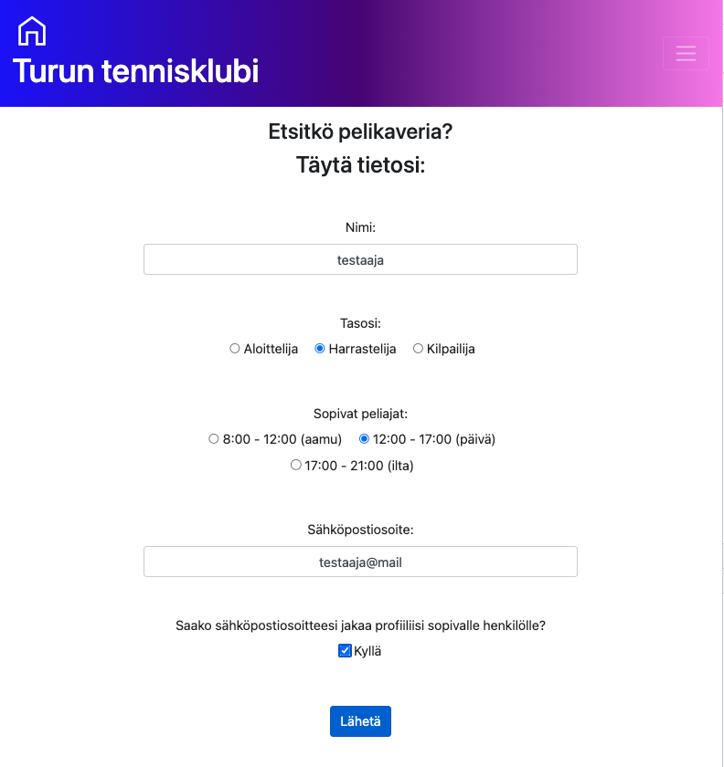

**Sovellus löytyy osoitteesta: https://tennis-app-backend.herokuapp.com/**

Sovellus on toteutettu responsiivisesti ja se toimii sekä mobiili, että
tietokonenäytöllä. Sovellus on fiktiivinen ja näin ollen sovelluksessa on
käytetty lorem ipsumia aidon tekstin sijaan. Sovellus on pyritty tekemään
mahdollisimman helppokäyttöiseksi.

## Sovelluksen käyttöohjeet:

### Yleiset ohjeet:

Sivuston ylälaidasta löydät navigointipalkin. Sen vasemmasta laidasta löydät kotipainikkeen ja otsikon. Painamalla jompaa kumpaa niistä, siirryt kotisivulle.

Navigointipalkin oikeasta laidasta löydät navigointilinkit sovelluksen sivuille. Painamalla haluamaasi otsikkoa siirryt kyseiselle sivulle.

Mobiilinäytöllä navigointilinkit muuttuvat hampurilaismenuksi.

Painamalla hampurilaismenua
avautuu sovelluksen sivuvalikko. Sieltä painamalla haluamaasi sivua siirryt kyseiselle sivulle.

Vierittäessäsi sivua alaspäin ilmestyy oikeaan laitaan nuoli. Sitä painamalla siirryt automaattisesti takaisin sivun ylälaitaan.

Alhaalta löytyy myös linkit Facebookin ja Instagramin sivuille. Kuitenkin koska sivusto on fiktiivinen siirryt näitä painamalla vain kyseisten sovellusten pääsivuille.

### Ajankohtaista sivu:

Ajankohtaista-sivulta löydät sovelluksen ajankohtaiset aiheet. Näitä voi lisätä vain admin käyttäjä. Lisääminen onnistuu kirjautumalla seuraavaan osoitteeseen: https://tennis-app-backend.herokuapp.com/admin.

Sivulla näytetään aina viisi uusinta aihetta. Painamalla otsikoiden vieressä olevia nuolia näet aiheen sisällön ruudullasi.

### Ajanvaraukset:

Painamalla Ajanvaraukset-sivua aukeaa näytölle lisäotsikoita. Painamalla haluamaasi ala-otsikkoa siirryt kyseiselle sivulle.

### Ajanvaraus:

Ajanvaraus sivulla voit tehdä kenttävarauksia.

Taulukosta voit valita haluamasi päivän painamalla päivämääräruutua. Kalenterissa on automaattisesti estetty edellisten päivien valinta.

Kalenterista näet jo varatut vuorot (varattu) ja vapaat vuorot (vapaa). Voit valita vain vapaana olevia vuoroja painamalla haluamaasi vuoroa.

Painamisen jälkeen siirry automaattisesti eteenpäin. Tässä vaiheessa voit vielä vaihtaa vuoroa painamalla "Muuta varaus" -nappia. Tällöin sinun tulee tehdä varaus uudestaan.

Jos kuitenkin haluat varata kyseisen vuoron tulee sinun joko kirjautua jo olemassa olevalla tunnuksella tai luoda uusi tunnus.

Kaikki kentät tulee molemmissa lomakkeissa täyttää. Jos joku kenttä jää täyttämättä ilmoittaa sovellus siitä. Kun olet täyttänyt kaikki kentät paina varaa nappia.

Tämän jälkeen sovellus vielä varmistaa haluatko varata kyseisen vuoron. Painamalla "Calcel"-nappia varaus peruuntuu. Painamalla "OK"-nappia varaus tallentuu.

Molemmissa tapauksissa näytölle ilmestyy valintaasi viittaava teksti. Painamalla "OK"-nappia sulkeutuu kyseinen modaali ja pääset takaisin sovelluksen sivulle.

### Varaustiedot:

Varaustiedot-sivulle kirjautumalla voit tarkastella tehtyjä varauksiasi. Tämä onnistuu täyttämällä kaikki kentät ja painamalla "kirjaudu"-nappia. Sovellus ilmoittaa, jos olet jättänyt jonkun kentän täyttämättä tai kirjaudut väärällä sähkäpostiosoitteella tai salasanalla. Tällöin saat näyttöön ilmestyvän modaalin suljettua painamalla "OK"-nappia (kts. Ajanvaraus-kohtaa). [kts. Ajanvaraus-kohtaa](#check)

Voit tarkastella sivulla omia tietojasi painamalla sivun keskeltä tai vasemmasta laidasta (suuri näyttö) löytyviä nappeja. Voit muuttaa omia osoite tietojasi muuttamalla tekstikentän tietoja ja painamalla muokkaa nappia.

Voit tarkastella ja halutessasi poistaa omia varauksiasi.Sivu ei näytä jo vanhentuneita varauksiasi. Varauksen poistaminen onnistuu painamalla kyseisen varauksen oikeassa reunassa olevaa "Poista"-nappia. Sovellus vielä varmistaa haluatko varmasti poistaa kyseisen varauksen. [kts. Ajanvaraus-kohtaa](#check)

### Pelikaveri:

Pelikaverit sivun kautta voit etsiä uusia pelikavereita. Täyttämällä lomakkeen ja painamalla tämän jälkeen "Lähetä"-nappia siirryt sivulle, josta löydät profiiliisi sopivia pelikavereita. Sovellus pitää huolen, ettei se ehdota pelikavereita, jotka ovat eri tasoisia tai heille sopivat peliajat ovat erit. Sovellukseen ilmestyy taas modaali joka varmistaa haluatko varmasti tallentaa kyseiset tiedot. [kts. Ajanvaraus-kohtaa](#check)

Voit valita haluamasi pelikaverin painamalla kyseistä sähköpostiosoitetta. Kuitenkin koska sovellus on fiktiivinen eivät osoitteet ole oikeita.

### Yhteystiedot:

Yhteystiedot-sivun kautta voit lähettää Turun tennisklubille sähkökostia. Täyttämällä kaikki kentät ja painamalla "Lähetä"-nappia lähtee viesti eteenpäin. Kuitenkin koska sivusto on fiktiivinen ei sähköposti siirry kyseiselle järjestölle. Sähköposti siirtyy sovelluksen tekijän henkilökohtaiseen (niin sanotulle kakkos) sähköpostiin.

## Admin käyttäjän sivustot:

Sivusto löytyy osoitteesta: https://tennis-app-backend.herokuapp.com/admin

Jos olet admin käyttäjä ja olet saanut admin käyttäjän oikeudet voit lisätä Ajankohtaiset-sivulle uusia ajankohtaisia asioita.

Kirjaudu sivulle täyttämällä kaikki kohdat ja painamalla "Kirjaudu"-nappia. Jos et taytä kaikkia kohtia sovellus ilmoittaa siitä. [kts. Ajanvaraus-kohtaa](#check)

Näytölle ilmestyy lomake, jonka täyttämällä ja "Lähetä"-painiketta painamalla voit lisät Ajankohtaista sivulle uusia ajankohtaisia asioita.

Voit vielä tarkistaa tallentuiko täyttämäsi tiedot kirjautumalla Ajankohtaista-sivulle.

